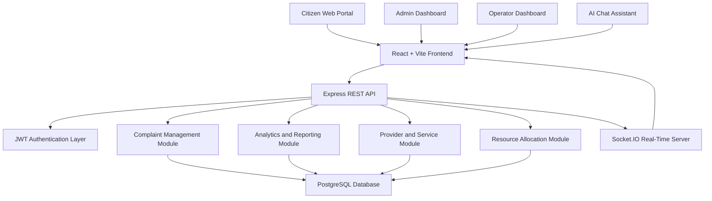
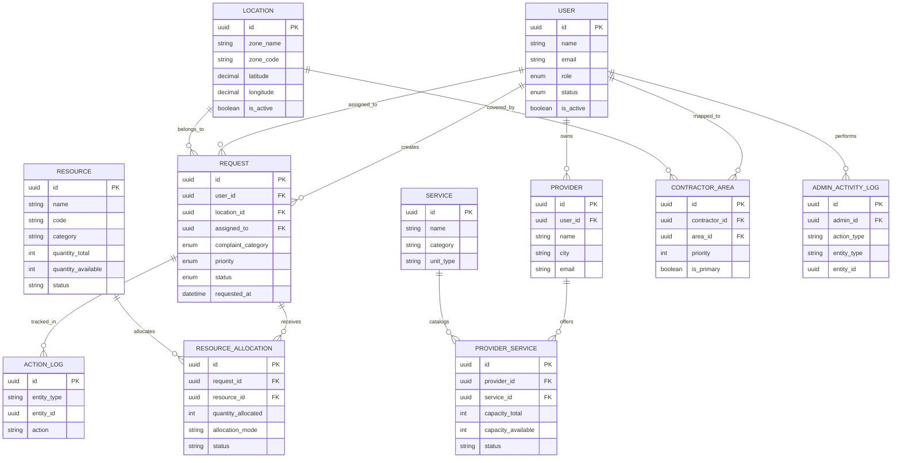
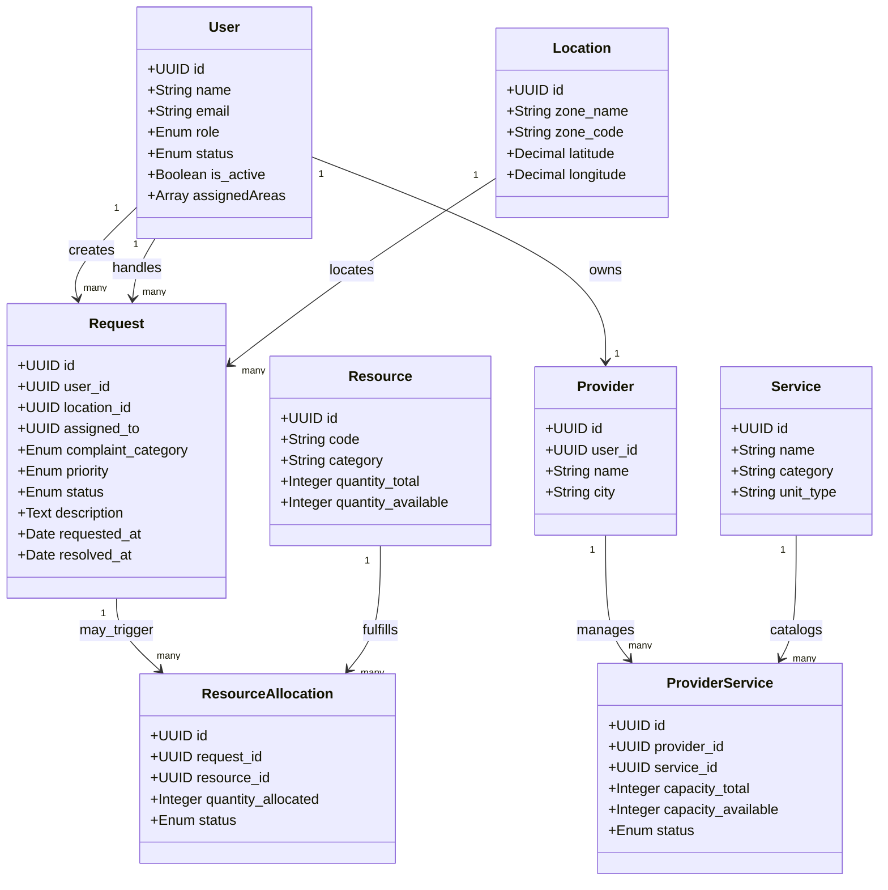
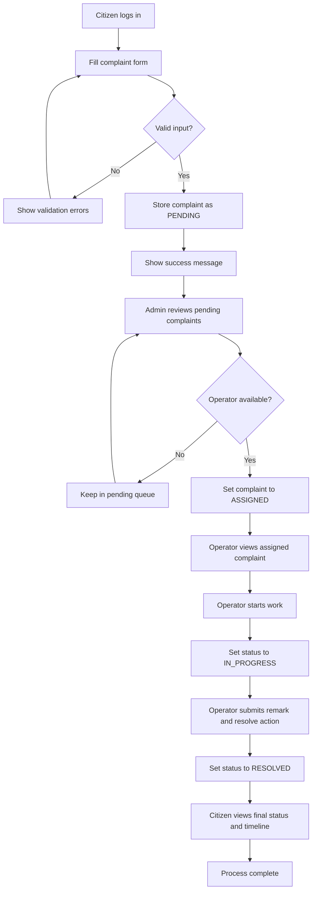
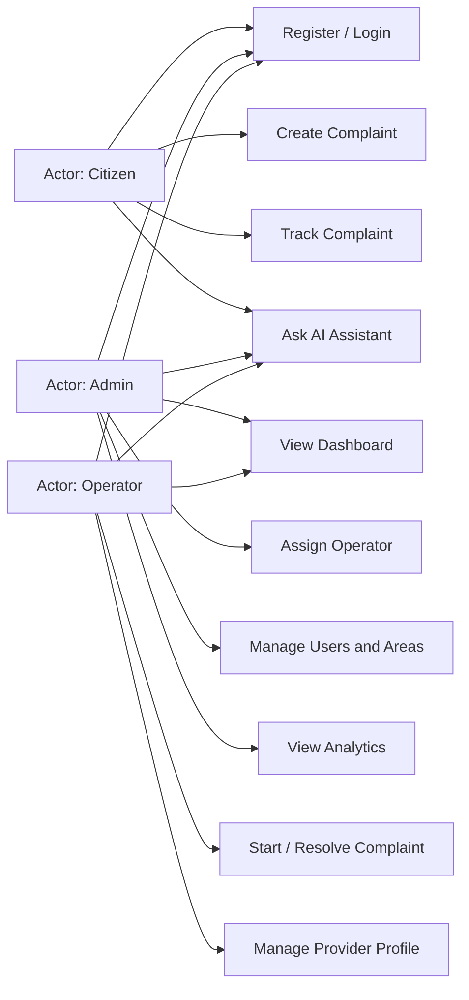

# Smart City Resource Allocation and Complaint Management System

## College Project Documentation

Prepared from the current implementation available in this repository. The project functions as a smart-city complaint handling platform with operator assignment, analytics, provider management, resource allocation support, and an AI-assisted chat interface.

## Index

Note: The section order matches the index image. Page numbers can be adjusted after exporting this report to Word or PDF.

| Sr. No. | Title | Reference Page No. |
| --- | --- | --- |
| 1 | Abstract | 5 |
| 2 | Introduction | 6 |
| 3 | Existing System | 7 |
| 4 | Need of Project | 8 |
| 5 | Scope of Project | 9-10 |
| 6 | Proposed System | 11-12 |
| 7 | Fact Finding Technique | 13-14 |
| 8 | Feasibility Study | 15-16 |
| 9 | Technical Requirements | 17 |
| 10 | Design Specification | 18-22 |
| 11 | Testing of Software | 23-24 |
| 12 | Screen Layout | 25-32 |
| 13 | Data Dictionary | 33-34 |
| 14 | Draw Backs | 35-36 |
| 15 | Future Enhancement | 37-38 |
| 16 | Bibliography | 39 |

## 1. Abstract

The Smart City Resource Allocation and Complaint Management System is a web-based platform developed to improve the reporting, tracking, assignment, and resolution of civic issues. Citizens can register complaints related to road damage, garbage, water, street lights, and other public-service problems using a structured online form with location details and image upload support. Administrators monitor citywide activity through an analytics dashboard, assign complaints to operators, manage service areas, and review audit logs. Operators receive assigned complaints, update work status, maintain provider-related details, and submit resolution remarks. The system uses React for the frontend, Node.js and Express for the backend, PostgreSQL through Sequelize ORM for data persistence, JWT for authentication, and Socket.IO for live complaint updates. In addition to the complaint workflow, the project includes data models for provider services and resource allocation so that civic operations can be extended from issue reporting to resource dispatch. The platform increases transparency, reduces manual effort, supports accountability, and provides a scalable digital foundation for smart-city governance.

## 2. Introduction

Urban administration faces constant pressure to resolve public-service complaints quickly and efficiently. Traditional complaint registration processes often rely on phone calls, paper records, or disconnected software tools, which makes it difficult to track cases, assign responsibility, and measure service performance. Citizens rarely receive real-time updates, and city administrators struggle to balance workload across available operators.

This project addresses that gap by creating a centralized digital platform for complaint capture, operator assignment, resolution tracking, and administrative monitoring. The application supports three major roles: citizen, operator, and administrator. Citizens create complaints and track progress. Administrators supervise the system, allocate operators, manage service areas, and view analytics. Operators handle field complaints, update progress, and record resolution details.

The implemented solution is a full-stack web application. The client side is built using React and Vite, with custom hooks, reusable components, and role-based route protection. The server side is built using Node.js, Express, Sequelize, and PostgreSQL. The overall objective is to make city operations more responsive, measurable, and citizen-friendly while keeping the platform extensible for future resource-allocation and intelligent-assistance features.

## 3. Existing System

In many local complaint-handling environments, the existing system is semi-manual and fragmented. Complaints may be reported through calls, registers, messaging groups, or separate spreadsheets maintained by staff members. This approach creates several operational problems:

- Complaint information is stored in different places and is difficult to consolidate.
- Assignment of field staff depends heavily on manual coordination.
- Citizens do not receive clear status updates after submission.
- Supervisors cannot easily identify overdue or unresolved cases.
- Performance analytics and workload balancing are weak or absent.
- Historical records and accountability trails are difficult to maintain.

The result is delayed service delivery, duplication of work, poor transparency, and limited scope for data-driven planning. A digital platform is therefore necessary to convert complaint handling into a controlled, traceable, and measurable workflow.

## 4. Need of Project

The project is needed to modernize public-service complaint handling and bring smart-city principles into day-to-day civic operations. A centralized system is required for the following reasons:

- To allow citizens to submit complaints online with category, description, area, address, coordinates, and image evidence.
- To reduce manual communication between supervisory staff and field operators.
- To assign complaints in a structured and accountable manner.
- To track complaint states from `PENDING` to `RESOLVED`.
- To improve visibility through dashboards, statistics, heatmaps, and operator performance reports.
- To maintain audit logs for administrative activities and complaint actions.
- To support future expansion into automated resource allocation, predictive analytics, and AI-assisted support.

The project directly improves service transparency, resolution speed, and managerial control. It also creates a reusable technical foundation for broader smart-city services.

## 5. Scope of Project

The scope of the project covers the design and implementation of a smart-city civic issue management platform with the following in-scope capabilities:

- Citizen registration, login, password recovery, and complaint submission.
- Role-based dashboards for citizen, operator, and administrator.
- Complaint lifecycle management with status transitions.
- Administrative assignment of complaints to operators.
- Area-based complaint handling and operator coverage support.
- Admin analytics, export, overdue tracking, and activity logs.
- Operator complaint handling, remarks, and profile management.
- Provider, service, and resource-allocation data structures for future expansion.
- AI-powered chat assistance for authenticated users.

The present implementation is focused mainly on complaint management and operator coordination. The resource-allocation module is partially modeled in the backend and can be expanded into a larger logistics layer in future versions. Mobile applications, public open-data integration, multilingual UI, and advanced machine-learning dispatch are outside the current implementation scope but are suitable future extensions.

## 6. Proposed System

The proposed system is a centralized, secure, web-based application that digitizes the full complaint-resolution workflow for municipal operations. The platform is divided into frontend, backend, database, and supporting real-time services.

### Major Functional Modules

1. `Authentication and Authorization`
   Secure login, registration, JWT-based session handling, Google login, password reset, and role-based access control.
2. `Citizen Complaint Management`
   Submission of civic complaints with category, priority, location, pincode, address, map-based coordinates, and image upload.
3. `Administrative Control Panel`
   View all complaints, review pending complaints, assign operators, monitor overdue complaints, manage users, create operators, maintain area master data, and review logs.
4. `Operator Workflow`
   View assigned complaints, start work, update status, resolve complaints, and maintain operator/provider information.
5. `Analytics and Monitoring`
   Dashboard cards, category trends, status statistics, heatmap views, operator performance, and complaint export.
6. `Resource Allocation Support`
   Backend support for resources, allocations, providers, and service capacities to extend the system into dispatch operations.
7. `AI Assistant`
   Role-aware chat support that can answer questions based on live complaint context.

### Proposed Workflow

1. The citizen logs in and submits a complaint.
2. The system stores the complaint with `PENDING` status.
3. The administrator reviews pending complaints and assigns an operator.
4. The operator receives the complaint, starts work, and updates the status.
5. After resolution, the operator submits remarks and the complaint is marked `RESOLVED`.
6. The citizen can track the complaint history and final outcome.
7. Administrators use analytics to monitor service quality and workload distribution.

The proposed solution improves accuracy, speed, auditability, and service visibility compared to the manual system.

## 7. Fact Finding Technique

Fact finding is an essential part of software engineering because the success of the system depends on correct understanding of user needs, operational problems, and environmental constraints. For this project, the following requirement-gathering and fact-finding techniques are appropriate and reflected in the implemented modules:

### 7.1 Observation

Observation helps identify how complaints are actually raised, forwarded, assigned, and resolved in current practice. By observing the movement of complaint information across staff roles, it becomes clear that delays often occur due to missing records, repeated communication, and lack of ownership tracking.

### 7.2 Interviews and Informal Discussions

Interacting with likely stakeholders such as citizens, supervisory staff, operators, and administrators helps reveal the system's practical expectations. Citizens require easy complaint submission and status visibility. Administrators need analytical control, area management, and operator assignment. Operators need a compact view of active work and complaint details.

### 7.3 Document Analysis

Existing registers, spreadsheets, paper forms, screenshots, and complaint templates provide useful domain inputs. The current project structure itself also acts as a primary source of documentation through route definitions, model files, frontend screens, and architecture notes.

### 7.4 Prototyping

The frontend pages and dashboards serve as working prototypes. Forms, complaint cards, maps, admin dashboards, and protected routes help validate whether the system structure is understandable and suitable for the users.

### 7.5 Feedback-Based Refinement

The presence of admin analytics, overdue complaint tracking, operator area coverage, and chat support suggests iterative improvement based on evolving operational needs. Requirement refinement is therefore treated as a continuous process instead of a one-time activity.

## 8. Feasibility Study

Feasibility analysis determines whether the project can be implemented successfully in practical conditions.

### 8.1 Technical Feasibility

The project is technically feasible because it uses widely adopted and stable technologies: React, Vite, Node.js, Express, PostgreSQL, Sequelize, JWT, and Socket.IO. These technologies are well supported, scalable, and suitable for full-stack web applications. The repository already demonstrates that the architecture, routing, authentication, model layer, and dashboards are implementable within the selected stack.

### 8.2 Economic Feasibility

The project is economically feasible because it relies primarily on open-source technologies. Development tools, frameworks, and libraries are freely available. The major cost components are developer time, hosting, database deployment, and optional third-party services such as SMTP, Google authentication, or AI API usage. For an academic or pilot deployment, costs remain low.

### 8.3 Operational Feasibility

The proposed system is operationally feasible because it aligns with the work patterns of all user roles. Citizens are familiar with web-based complaint submission. Administrators can easily adapt to dashboard-driven monitoring. Operators receive a focused workflow for assigned complaints. The role-based UI and straightforward state transitions reduce operational complexity.

### 8.4 Schedule Feasibility

The project is suitable for phased implementation. Core functionality such as authentication, complaint submission, assignment, and tracking can be delivered first. Analytics, provider features, real-time notifications, and AI assistance can be added incrementally. This phased structure makes the project manageable within academic project timelines.

### 8.5 Legal and Security Feasibility

The project is feasible from a legal and security perspective when deployed with standard safeguards such as HTTPS, protected credentials, access control, and responsible storage of user data. The current implementation already includes JWT authentication, password hashing, role-based authorization, security headers, audit logging, and reset-token hashing.

## 9. Technical Requirements

### 9.1 Hardware Requirement

| Component | Minimum Requirement | Recommended Requirement |
| --- | --- | --- |
| Processor | Dual-core CPU | Intel i5 / Ryzen 5 or above |
| RAM | 4 GB | 8 GB or above |
| Storage | 10 GB free space | SSD with 20 GB free space |
| Internet | Basic broadband | Stable broadband connection |
| Display | 1366 x 768 | Full HD or above |

### 9.2 Software Requirement

| Software | Purpose |
| --- | --- |
| Windows / Linux / macOS | Development or deployment environment |
| Node.js | Backend runtime and frontend tooling |
| React 19 + Vite | Frontend development |
| Express 5 | Backend REST API |
| PostgreSQL | Relational database |
| Sequelize ORM | Database modeling and data access |
| Socket.IO | Real-time complaint updates |
| Axios | API communication |
| JWT | Authentication and authorization |
| Git | Version control |
| Modern browser | Application access |

## 10. Design Specification

### 10.1 Schema Diagram

### 10.2 ER Diagram

### 10.3 Class Diagram

### 10.4 Activity Diagram

### 10.5 UML Diagram

## 11. Testing of Software

Testing ensures that the system behaves correctly for different roles and operational scenarios. The current implementation supports functional testing, integration testing, validation testing, and security-related verification.

### 11.1 Testing Objectives

- Verify that authentication and authorization work correctly.
- Validate complaint submission and status transitions.
- Confirm that only authorized users can access protected routes.
- Ensure data is correctly stored and retrieved from the database.
- Validate dashboard analytics and operator assignment behavior.

### 11.2 Sample Test Cases

| Test Case | Input / Action | Expected Result |
| --- | --- | --- |
| User registration | Citizen submits valid registration form | Account created and tokens returned |
| Invalid login | Wrong password entered | Login rejected with error message |
| Complaint creation | Citizen fills required complaint fields | Complaint saved with `PENDING` status |
| Area validation | Citizen submits incomplete location data | Validation error displayed |
| Admin assignment | Admin assigns operator to pending complaint | Complaint becomes `ASSIGNED` |
| Operator workflow | Operator starts assigned complaint | Complaint becomes `IN_PROGRESS` |
| Complaint resolution | Operator resolves complaint with remark | Complaint becomes `RESOLVED` |
| Unauthorized access | Citizen tries to access admin route | Access denied / redirected |
| Dashboard analytics | Admin opens dashboard | KPIs and charts load successfully |
| Password reset | User submits valid reset token | Password updated successfully |

### 11.3 Testing Types Used

- `Unit Testing`: validation logic, helper utilities, model constraints.
- `Integration Testing`: request flow between API, database, and authentication middleware.
- `System Testing`: complete workflow from complaint creation to resolution.
- `Security Testing`: token verification, password policy, route protection, and input checks.
- `User Interface Testing`: form validation, role-based navigation, and dashboard rendering.

## 12. Screen Layout

The system contains separate layouts for each role and uses protected routing to ensure the correct dashboard is displayed after login.

| Screen | Route / Module | Main Layout Elements |
| --- | --- | --- |
| Landing Page | `/` | Intro section, feature summary, complaint categories, platform statistics |
| Login Page | `/login` | Email, password, login button, forgot password link |
| Register Page | `/register` | Name, email, password, confirm password, registration action |
| Forgot Password | `/forgot-password` | Email input and reset request action |
| Citizen Dashboard | `/citizen/dashboard` | Summary metric cards, quick complaint overview, navigation options |
| Create Complaint | `/citizen/create-request` | Category, priority, description, area, address, pincode, image upload, live map, coordinates |
| My Complaints | `/citizen/my-requests` | Complaint list, search, filters, status badges, detail links |
| Complaint Detail | `/complaints/:id` | Complaint summary, timeline, operator info, resolution remark |
| Operator Dashboard | `/operator/dashboard` | Assigned work summary, status-based metrics, complaint overview |
| Operator Complaints | `/operator/complaints` | Complaint cards, start-work action, detail navigation |
| Operator Profile | `/operator/profile` | Provider details, contact data, profile photo, service management |
| Admin Dashboard | `/admin/dashboard` | KPI cards, trends, category charts, status charts, heatmap, location map, operator performance, overdue list |
| Pending Complaints | `/admin/pending-complaints` | Unassigned complaint queue, assignment controls |
| Users Page | `/admin/users` | User list, operator visibility, status controls, area configuration |
| Add Operator | `/admin/add-operator` | Operator creation form with workload and area mapping inputs |
| Activity Logs | `/admin/activity-logs` | Administrative audit trail and activity history |
| Chat Widget | Shared | Floating assistant, role-aware prompts, live help for all authenticated users |

### Screen Flow Summary

1. Public users land on the home page and move to login or registration.
2. Citizens access the dashboard and complaint form after authentication.
3. Admin users access dashboards, pending complaints, user management, and logs.
4. Operators access assigned complaints, update status, and maintain profile data.
5. All authenticated roles can open the complaint detail page and use the chat assistant.

## 13. Data Dictionary

The following tables summarize the major database entities used in the application.

### 13.1 User

| Field | Type | Description |
| --- | --- | --- |
| `id` | UUID | Primary key for user |
| `name` | String | User full name |
| `email` | String | Unique login email |
| `password_hash` | Text | Encrypted password |
| `role` | Enum | `ADMIN`, `OPERATOR`, `CITIZEN` |
| `status` | Enum | `active` or `suspended` |
| `assignedAreas` | Array | Areas handled by operator |
| `max_active_complaints` | Integer | Workload limit for operator |

### 13.2 Request

| Field | Type | Description |
| --- | --- | --- |
| `id` | UUID | Primary key for complaint |
| `user_id` | UUID | Citizen who created complaint |
| `location_id` | UUID | Related area or location |
| `assigned_to` | UUID | Operator assigned to complaint |
| `complaint_category` | Enum | `ROAD`, `GARBAGE`, `WATER`, `LIGHT`, `OTHER` |
| `priority` | Enum | `LOW`, `MEDIUM`, `HIGH`, `EMERGENCY` |
| `description` | Text | Complaint details |
| `status` | Enum | `PENDING`, `ASSIGNED`, `IN_PROGRESS`, `RESOLVED` |
| `operator_remark` | Text | Final field remark |
| `requested_at` | DateTime | Complaint creation timestamp |
| `resolved_at` | DateTime | Complaint closure timestamp |

### 13.3 Location

| Field | Type | Description |
| --- | --- | --- |
| `id` | UUID | Primary key |
| `zone_name` | String | Name of city area |
| `zone_code` | String | Unique area code |
| `latitude` | Decimal | Geographic latitude |
| `longitude` | Decimal | Geographic longitude |
| `is_active` | Boolean | Area status |

### 13.4 ContractorArea

| Field | Type | Description |
| --- | --- | --- |
| `id` | UUID | Primary key |
| `contractor_id` | UUID | Operator reference |
| `area_id` | UUID | Area reference |
| `priority` | Integer | Area assignment priority |
| `is_primary` | Boolean | Whether it is the main area |
| `weight` | Integer | Weight used for balancing |

### 13.5 Provider and Service

| Field | Type | Description |
| --- | --- | --- |
| `Provider.user_id` | UUID | Operator who owns provider profile |
| `Provider.name` | String | Provider name |
| `Provider.city` | Enum | City served by provider |
| `Service.name` | String | Service title |
| `Service.category` | Enum | `WATER`, `FOOD`, `MEDICAL`, `FUEL`, `PARKING`, `EQUIPMENT`, `OTHER` |
| `ProviderService.capacity_total` | Integer | Total service capacity |
| `ProviderService.capacity_available` | Integer | Available service capacity |
| `ProviderService.status` | Enum | `ACTIVE`, `PAUSED`, `INACTIVE` |

### 13.6 Resource and ResourceAllocation

| Field | Type | Description |
| --- | --- | --- |
| `Resource.code` | String | Unique resource code |
| `Resource.category` | Enum | Resource type |
| `Resource.quantity_total` | Integer | Total stock |
| `Resource.quantity_available` | Integer | Available stock |
| `Resource.status` | Enum | `ACTIVE`, `MAINTENANCE`, `DECOMMISSIONED` |
| `ResourceAllocation.request_id` | UUID | Related complaint/request |
| `ResourceAllocation.resource_id` | UUID | Allocated resource |
| `ResourceAllocation.quantity_allocated` | Integer | Quantity assigned |
| `ResourceAllocation.allocation_mode` | Enum | `AUTO`, `MANUAL`, `SYSTEM` |
| `ResourceAllocation.status` | Enum | Allocation delivery status |

### 13.7 Logs

| Field | Type | Description |
| --- | --- | --- |
| `ActionLog.entity_type` | String | Type of tracked entity |
| `ActionLog.entity_id` | UUID | Entity identifier |
| `ActionLog.action` | String | Action performed |
| `AdminActivityLog.admin_id` | UUID | Admin who performed action |
| `AdminActivityLog.action_type` | String | Administrative event type |
| `AdminActivityLog.metadata` | JSONB | Additional details |

## 14. Draw Backs

Although the system is useful and functionally rich, the current implementation has some limitations:

- The primary live workflow is complaint management; the full resource-allocation experience is not yet fully surfaced in the frontend.
- The system depends on internet availability and centralized server access.
- In-memory rate limiting is suitable for smaller deployments but not ideal for distributed production scale.
- Mobile app support is not yet available.
- Citizen feedback, satisfaction rating, and post-resolution review are not fully implemented.
- External GIS integrations, SMS alerts, and multilingual interfaces are not yet included.
- Automated test coverage is not yet fully documented in the repository.
- Final college-report assets such as all screen captures may still need to be inserted manually if required by the institution.

These drawbacks do not reduce the value of the system, but they identify improvement areas for the next release.

## 15. Future Enhancement

The project has strong potential for expansion. Important future enhancements include:

- Automatic complaint assignment based on workload, proximity, and priority.
- Dedicated mobile application for citizens and operators.
- Citizen feedback and complaint-rating mechanism after resolution.
- Real-time push notifications through SMS, email, and mobile alerts.
- GIS integration with richer mapping and zone intelligence.
- Predictive analytics for complaint hotspots and seasonal issue forecasting.
- Multilingual interface for wider accessibility.
- Public grievance transparency portal for resolved and ongoing issues.
- Resource dispatch workflow integrated directly with complaint categories.
- Image storage through cloud services instead of large inline payloads.
- Enhanced AI assistant for summarization, triage suggestions, and admin insights.
- Advanced SLA escalation rules and automated supervisor reminders.

## 16. Bibliography

1. Project source code, routes, models, and UI modules from this repository.
2. `ARCHITECTURE.md` in the project root.
3. `docs/BUSINESS_LOGIC.md`.
4. `docs/FRONTEND_ARCHITECTURE.md`.
5. `docs/AUTHENTICATION.md`.
6. React Documentation, [https://react.dev](https://react.dev).
7. Node.js Documentation, [https://nodejs.org](https://nodejs.org).
8. Express Documentation, [https://expressjs.com](https://expressjs.com).
9. Sequelize Documentation, [https://sequelize.org](https://sequelize.org).
10. PostgreSQL Documentation, [https://www.postgresql.org/docs/](https://www.postgresql.org/docs/).
11. Socket.IO Documentation, [https://socket.io/docs/v4/](https://socket.io/docs/v4/).
