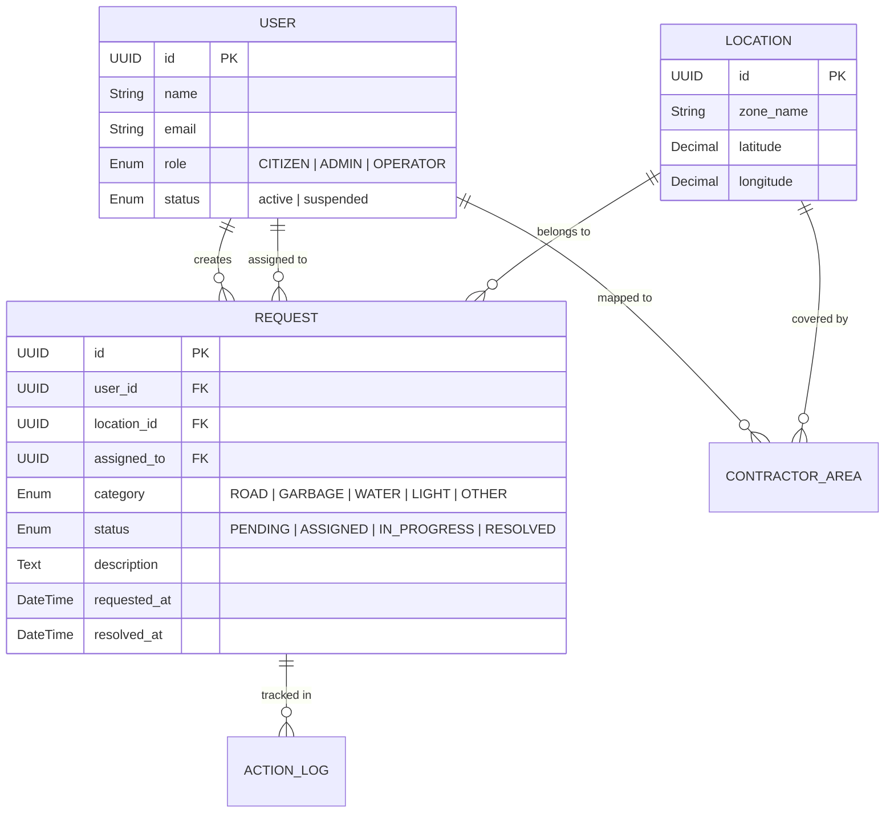

# Smart City Complaint Management System — Explained Simply

> This document is written as if you are explaining your project to an external examiner in a viva or project presentation.

---

## 🎯 "Sir/Ma'am, What Is This Project?"

Our project is a **Smart City Complaint Management System** — a web-based platform where **citizens of a city can report civic problems** (like potholes, garbage, water leakage, broken street lights), and **the city administration can track, assign, and resolve those complaints** through a structured digital workflow.

Think of it like a **"Swachh Bharat" or municipal complaint app**, but built from scratch as a full-stack web application.

---

## 👥 "Who Uses This System?" — The Three Roles

Our system has **three types of users**, each with a different dashboard and set of permissions:

| Role | Who Are They? | What Can They Do? |
|------|--------------|-------------------|
| **Citizen** | A regular city resident | Register, log in, file a complaint with category + description + location + photo, and track its status |
| **Admin** | A city official / supervisor | View all complaints, see analytics & charts, assign complaints to operators, manage users & service areas |
| **Operator** | A field worker (e.g., road repair crew) | See only complaints assigned to them, mark "work started", mark "resolved" with a remark when done |

> **Key point for the examiner:** Every user sees a **different dashboard** based on their role. A citizen cannot access admin pages, and an operator cannot see all city complaints — this is **role-based access control**.

---

## 🔄 "How Does a Complaint Flow Through the System?" — The Lifecycle

This is the **core workflow** of our project. Every complaint moves through exactly **4 stages**:

```
   CITIZEN files complaint
          │
          ▼
   ┌──────────────┐
   │   PENDING     │  ← "Waiting for someone to look at it"
   └──────┬───────┘
          │  Admin assigns an operator
          ▼
   ┌──────────────┐
   │   ASSIGNED    │  ← "An operator has been given this task"
   └──────┬───────┘
          │  Operator clicks "Start Work"
          ▼
   ┌──────────────┐
   │ IN_PROGRESS   │  ← "Operator is on-site, fixing the issue"
   └──────┬───────┘
          │  Operator clicks "Resolve" + adds remark
          ▼
   ┌──────────────┐
   │   RESOLVED    │  ← "Done! Citizen can see the resolution"
   └──────────────┘
```

### A Real Example:

1. **Citizen Ramesh** logs in and creates a complaint: *"There is a big pothole on MG Road near the park"* — selects category **ROAD**, drops a pin on the map, uploads a photo.
2. Complaint is saved as **PENDING**.
3. **Admin Priya** opens her dashboard, sees the pending complaint, and assigns it to **Operator Suresh** who handles that area.
4. **Operator Suresh** sees the complaint in his dashboard, clicks **"Start Work"** — status becomes **IN_PROGRESS**.
5. Suresh fixes the pothole, then clicks **"Resolve"** and types: *"Pothole filled with asphalt. Road is safe now."*
6. **Citizen Ramesh** checks his complaints list — sees status = **RESOLVED**, operator name = Suresh, and the remark.

> **Why is this important?** This gives full **transparency and accountability**. Every action is timestamped — when was it filed, when was it assigned, when did work start, when was it resolved.

---

## 🏗️ "What Is the Tech Stack?" — How Is It Built?

Our system uses a **client-server architecture** (also called a 3-tier architecture):

```
┌────────────────────────────────────────────────┐
│              FRONTEND (Client)                  │
│  React 19 + Vite + TailwindCSS                 │
│  Runs in the user's browser                     │
│  Responsible for: UI, forms, dashboards, maps   │
└─────────────────────┬──────────────────────────┘
                      │  HTTP requests (REST API)
                      │  + JWT tokens for auth
                      ▼
┌────────────────────────────────────────────────┐
│              BACKEND (Server)                   │
│  Node.js + Express.js                           │
│  Responsible for: business logic, auth,         │
│  validation, API endpoints                      │
└─────────────────────┬──────────────────────────┘
                      │  SQL queries via Sequelize ORM
                      ▼
┌────────────────────────────────────────────────┐
│              DATABASE                           │
│  PostgreSQL                                     │
│  Stores: Users, Complaints, Locations,          │
│  Logs, Providers, Resources                     │
└────────────────────────────────────────────────┘
```

### Technology Justification Table (Examiner-Friendly):

| Technology | Why We Used It |
|-----------|---------------|
| **React** | Component-based UI, fast rendering with Virtual DOM, huge ecosystem |
| **Vite** | Blazing-fast development server, modern build tool (much faster than Webpack) |
| **Node.js + Express** | JavaScript on server-side, non-blocking I/O, great for API servers |
| **PostgreSQL** | Reliable relational database, supports complex queries, ACID-compliant |
| **Sequelize ORM** | Lets us write database queries in JavaScript instead of raw SQL, handles migrations |
| **JWT (JSON Web Tokens)** | Stateless authentication — no need to store sessions on the server |
| **Socket.IO** | Real-time updates — when a complaint status changes, the UI updates instantly |
| **Axios** | HTTP client for making API calls from frontend to backend |
| **Zustand** | Lightweight state management for React (simpler alternative to Redux) |
| **Leaflet** | Interactive maps — citizens can pin complaint locations on a map |
| **Recharts** | Beautiful charts and graphs on the admin analytics dashboard |
| **bcryptjs** | Secure password hashing (passwords are never stored in plain text) |
| **Docker** | Containerization for easy deployment and database setup |

---

## 🔐 "How Does Authentication Work?"

We use **JWT (JSON Web Token)** based authentication:

1. User logs in with email + password (or Google login).
2. Server verifies credentials and returns two tokens:
   - **Access Token** (valid for 15 minutes) — used for every API request
   - **Refresh Token** (valid for 7 days) — used to get a new access token without re-logging in
3. Every API request includes the access token in the `Authorization` header.
4. Server middleware verifies the token on every request. If invalid → 401 Unauthorized.
5. After verifying the token, another middleware checks the user's **role** → if a citizen tries to access an admin route → 403 Forbidden.

### Additional Security Features:
- **Password hashing** with bcrypt (12 rounds)
- **Strong password policy** (min 8 chars, uppercase, lowercase, number, special char)
- **Rate limiting** on login (max 5 failed attempts per 15 minutes per IP+email)
- **Forgot/Reset password** with hashed tokens sent via email
- **Google OAuth** login support
- **Audit logging** — every action is recorded with user ID and timestamp

---

## 🗄️ "What Does the Database Look Like?"

We have **11 tables** in our PostgreSQL database. The main ones are:



> **For the examiner:** We use **UUIDs** instead of auto-increment IDs for security (attackers can't guess the next ID). We have **indexes** on frequently queried columns (status, user_id, location_id) for performance.

---

## 📊 "What Can the Admin See?" — Admin Dashboard Features

The Admin dashboard is the most feature-rich part of the system:

| Feature | What It Shows |
|---------|-------------|
| **KPI Cards** | Total complaints, resolved %, pending %, in-progress count |
| **Category Trends** | Bar/pie charts showing complaints by category (Road, Garbage, Water, etc.) |
| **Status Distribution** | How many complaints are in each status |
| **Heatmap** | Geographic map showing complaint hotspot areas |
| **Operator Performance** | Which operators are resolving fastest, who has the most workload |
| **Overdue Complaints** | Complaints that haven't been resolved within the expected time |
| **Data Export** | Download complaint data as CSV for reporting |
| **Activity Logs** | Full audit trail of all admin actions |

---

## 🤖 "What About AI?" — AI Chat Assistant

The system includes an **AI-powered chat assistant** accessible to all authenticated users. It is role-aware, meaning it understands who is asking and provides relevant help:
- Citizens can ask about complaint status or how to file complaints
- Admins can ask for analytics insights
- Operators can ask about their assigned work

This uses the **OpenAI API** on the backend.

---

## 🌐 "What Are the API Endpoints?" — REST API Structure

Our backend exposes a RESTful API. Here are the key endpoint groups:

| Endpoint Group | Example Route | Purpose |
|---------------|--------------|---------|
| **Auth** | `POST /api/auth/login` | Login, register, Google auth, password reset |
| **Citizen Complaints** | `POST /api/requests` | Create complaint, view my complaints |
| **Admin Management** | `GET /api/requests/admin/all` | View all complaints, assign operators, analytics |
| **Operator Workflow** | `POST /api/requests/:id/resolve` | Start work, resolve complaints |
| **Providers** | `GET /api/providers/services` | Operator service profiles |
| **Resource Allocation** | `POST /api/allocations/auto/:id` | Auto/manual resource dispatch (future module) |

---

## 📱 "What Pages Does The Frontend Have?"

| Page | Route | Who Sees It |
|------|-------|------------|
| Landing Page | `/` | Everyone |
| Login / Register | `/login`, `/register` | Public |
| Citizen Dashboard | `/citizen/dashboard` | Citizen |
| Create Complaint | `/citizen/create-request` | Citizen |
| My Complaints | `/citizen/my-requests` | Citizen |
| Complaint Detail | `/complaints/:id` | All (role-filtered) |
| Admin Dashboard | `/admin/dashboard` | Admin |
| Pending Complaints | `/admin/pending-complaints` | Admin |
| Users Management | `/admin/users` | Admin |
| Add Operator | `/admin/add-operator` | Admin |
| Activity Logs | `/admin/activity-logs` | Admin |
| Operator Dashboard | `/operator/dashboard` | Operator |
| Operator Complaints | `/operator/complaints` | Operator |
| Operator Profile | `/operator/profile` | Operator |

> All routes are **protected** — if you're not logged in, you're redirected to login. If you don't have the right role, you see an "Unauthorized" page.

---

## ⚡ "What Makes This Project Special?" — Key Highlights

1. **Full-Stack Implementation** — Not just a frontend mockup. Has a real backend, real database, real authentication.
2. **Role-Based Access Control** — Three distinct user experiences with enforced permissions.
3. **Complete Complaint Lifecycle** — From filing to resolution, with timestamps at every step.
4. **Real-Time Updates** — Socket.IO pushes live updates when complaint status changes.
5. **Interactive Maps** — Citizens pin locations on a Leaflet map; admins see complaint heatmaps.
6. **Analytics Dashboard** — Charts, KPIs, operator performance, overdue tracking.
7. **Security Best Practices** — JWT, bcrypt, rate limiting, audit logging, input validation, SQL injection prevention via ORM.
8. **AI Integration** — Role-aware chat assistant powered by OpenAI.
9. **Extensible Architecture** — Resource allocation and provider modules are already modeled for future expansion.
10. **Production-Ready Features** — Google OAuth, forgot password via email, profile photo upload, data export.

---

## 🔮 "What Are the Future Enhancements?"

| Enhancement | Description |
|------------|-------------|
| Auto-Assignment | ML-based operator assignment using workload, proximity, and priority |
| Mobile App | React Native app for citizens and operators |
| Citizen Feedback | Rating system after complaint resolution |
| SMS/Push Notifications | Alerts when complaint status changes |
| Predictive Analytics | Forecast complaint hotspots by season/area |
| Multilingual UI | Hindi, Marathi, and other regional languages |
| SLA Escalation | Auto-escalate unresolved complaints to senior admins |

---

## 📝 Quick Viva Q&A Cheat Sheet

| Question | Answer |
|----------|--------|
| *What architecture does your project use?* | 3-tier client-server architecture (React frontend → Express API → PostgreSQL database) |
| *Why JWT instead of sessions?* | JWT is stateless — the server doesn't need to store session data, making it more scalable |
| *How do you prevent SQL injection?* | We use Sequelize ORM which uses parameterized queries — user input never directly touches SQL |
| *How are passwords stored?* | Hashed using bcrypt with 12 salt rounds — we never store plain-text passwords |
| *What is the primary key type?* | UUID (v4) — more secure than auto-increment because IDs are not guessable |
| *How do you handle authorization?* | Middleware checks JWT token for authentication, then checks user role for authorization |
| *What happens if the access token expires?* | The client automatically uses the refresh token to get a new access token without forcing re-login |
| *What design pattern does the backend follow?* | MVC (Model-View-Controller) — Models (Sequelize), Controllers (business logic), Routes (endpoints) |
| *What is Socket.IO used for?* | Real-time complaint status updates — when an operator resolves a complaint, the citizen's page updates live |
| *How is the frontend state managed?* | Using Zustand — a lightweight state management library (simpler than Redux) |
| *What complaint categories are supported?* | ROAD, GARBAGE, WATER, LIGHT, OTHER |
| *What are the 4 complaint statuses?* | PENDING → ASSIGNED → IN_PROGRESS → RESOLVED |
